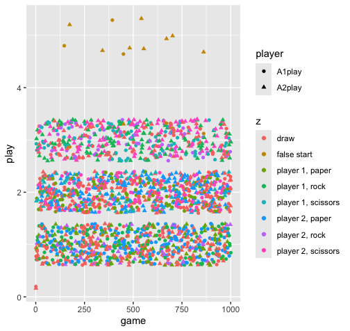
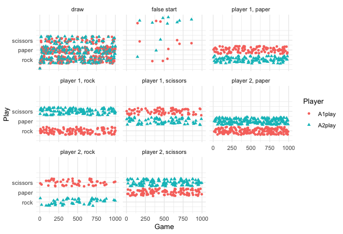

# Welcome to the exciting world of rock paper scissors.

RPS is a great example of a triangular victory vector game, rock smashes scissors, but is covered by paper. This collection of functions was inspired by other agent-based work in the RPS game space especially work by [Traulsen](https://www.evolbio.mpg.de/3460755/rock-paper-scissors) (2020) on cyclic dominance, psychological factors by [Cook et al](https://royalsocietypublishing.org/doi/10.1098/rspb.2011.1024) (2011), and practically by [Smolla](https://marcosmolla.wordpress.com/2015/07/16/an-introduction-to-agent-based-modelling-in-r/) (2014). Actual play is important as neural synchronous research would suggest that prediction alone does not produce the same result [Kayhan and Nyguen](https://pure.mpg.de/pubman/faces/ViewItemOverviewPage.jsp?itemId=item_3398665) (2022).

RPS offers insight into various human and ecological processes. The basic problem that this code solves are psychological processes in RPS. These ABMs are designed to allow you to manipulate the various underlying psychological structures of game play between agents.

RPS_base runs a traditional 1000 game simulation.

RPS_complete includes both ragequit and exhaustion accommodations. As players lose they become angry (prospect theory like hedonic returns [Kahneman and Tversky](https://web.mit.edu/curhan/www/docs/Articles/15341_Readings/Behavioral_Decision_Theory/Kahneman_Tversky_1979_Prospect_theory.pdf) (1979)), they also become less likely to play what just failed.

RPS_modules includes various parts which can be swapped into RPS_complete, like a cook estimator (players tend to copy each other) or relative rather than absolute math. The code is highly commented so different mechanics can be produced and copied in as needed.

## Quick Demo

```{r}
library(dplyr)
A1<-data.frame(A=.7, B=.33, C=.1, H=.5)
A2<-data.frame(A=.33, B=.33, C=.33, H=.5)
t=0
outcome<-data.frame(A1play = 0, A2play =0, z = "draw")
while(t<1000){
  #initialize plays
  a <- 1
  b <- 2
  c <- 3
  #player1
  weighted_value <- a * A1$A + b * A1$B + c * A1$C
  random_value <- rnorm(1, mean = weighted_value, sd = 1) # sd controls spread
  A1play<-round(random_value)
  A1play
  A1play <- if_else(A1play == 0, 1L, A1play)
  A1play <- if_else(A1play == 4, 3L, A1play)
  A1play <- abs(A1play)
  
  #player2
  weighted_value <- a * A2$A + b * A2$B + c * A2$C
  random_value <- rnorm(1, mean = weighted_value, sd = 1) # sd controls spread
  A2play<-round(random_value)
  A2play <- if_else(A2play == 0, 1L, A2play)
  A2play <- if_else(A2play == 4, 3L, A2play)
  A2play <- abs(A2play)

  #conditon 1 is draw
  #condition 2 is rock paper, condition 3 is rock scissors, 4 is paper rock, 5 is paper scissors
  #6 is scissors rock, 7 is scissors paper
  z<-if_else(A1play == A2play, "draw", if_else(A1play == 1 & A2play == 2, "player 2, paper", 
          if_else(A1play ==1 & A2play == 3, "player 1, rock", if_else(A1play ==2 & A2play == 1, "player 1, paper", 
                                                            if_else(A1play ==2 & A2play ==3, "player 2, scissors", 
                                                                    if_else(A1play == 3 & A2play ==1, "player 2, rock",
                                                                                                                           
                                                                            if_else(A1play == 3 & A2play ==2, "player 1, scissors", if_else(A1play == 0 | A2play ==0, "false start", "false start"))))))))
  new_row<-data.frame(A1play, A2play, z)
  
  outcome<-add_row(outcome, new_row)
  print(new_row)
  t<-t+1
}

outcome %>% group_by(z) %>% count()
```

And one might graph that outcome

```{r}
library(ggplot2)
library(dplyr)
library(tidyr)

#pivot for ease of graphing
outcomeB <- outcome %>%
  mutate(game = row_number()) %>%
  pivot_longer(
    cols = c(A1play, A2play), 
    names_to = "player",
    values_to = "play"
  )

#here is our GGPLOT
ggplot(outcomeB, aes(x = game, y = play, color = z, shape = player)) +
  geom_jitter()
  scale_y_continuous(breaks = 1:3, labels = c("rock","paper","scissors")) +
  labs(x = "Game", y = "Play", color = "Player", shape = "Player") +
  theme_minimal()

```

Proof of concept for the base model comes with these lovely results:

| Outcome                                  | Count |
|------------------------------------------|-------|
| Draw                                     | 230   |
| False Start                              | 11    |
| Paper over Rock (player 1 wins)          | 114   |
| Rock over Scissors (player 1 wins)       | 127   |
| Scissors over Paper (player 1 wins)      | 79    |
| Rock covered by Paper (player 2 wins)    | 181   |
| Scissors smashed by rock (player 2 wins) | 53    |
| Paper is cut by paper (player 2 wins)    | 116   |
| Total                                    | 1001  |

What are the false starts? In some cases the stochastic process throws a non-playable integer (moderate clamping is used).

What this looks like graphically (code from above):



Faceting can be helpful. Look at the player 1, rock - you see that the blue triangles are all on Scissors, thus player 2 went scissors, and was smashed by the red circles of rock. Paper was not played.



## Works Cited

Cook, Richard, Geoffrey Bird, Gabriele Lünser, Steffen Huck, and Cecilia Heyes. “Automatic Imitation in a Strategic Context: Players of Rock–Paper–Scissors Imitate Opponents’ Gestures†.” *Proceedings of the Royal Society B: Biological Sciences* 279, no. 1729 (2011): 780–86. <https://doi.org/10.1098/rspb.2011.1024>.

Kahneman, Daniel, and Amos Tversky. “Prospect Theory: Ana Analysis of Decision under Risk.” *Econometrica* 47, no. 2 (1979): 263–91.

Kayhan, Ezgi, T. Nguyen, Daniel Matthes, et al. “Interpersonal Neural Synchrony When Predicting Others’ Actions during a Game of Rock-Paper-Scissors.” *Scientific Reports* 12, no. 1 (2022). <https://doi.org/10.1038/s41598-022-16956-z>.

Smolla, Marco. “An Introduction to Agent-Based Modelling in R.” *Marco Smolla*, July 16, 2015. <https://marcosmolla.wordpress.com/2015/07/16/an-introduction-to-agent-based-modelling-in-r/>.

Trausen, Arne. “Rock, Paper, Scissors - Can Cyclic Dominance Explain Diversity of Species and Individuals?” Accessed August 27, 2025. <https://www.evolbio.mpg.de/3460755/rock-paper-scissors>.
